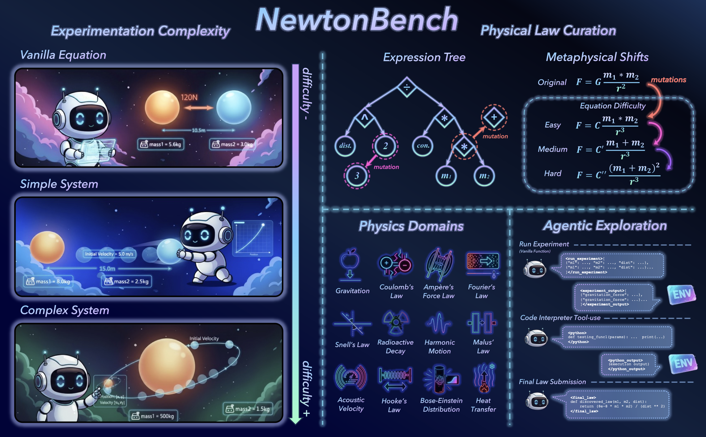

# NewtonBench: Benchmarking Generalizable Scientific Law Discovery in LLM Agents
[](https://github.com/HKUST-KnowComp/NewtonBench)
[](https://arxiv.org/abs/2510.07172)
[](https://www.python.org/)
[](https://visitorbadge.io/status?path=https%3A%2F%2Fgithub.com%2FHKUST-KnowComp%2FNewtonBench)
[](https://github.com/HKUST-KnowComp/NewtonBench/releases)
<div align="center">

### 🔭 **Can LLMs Rediscover Newton's Laws?** 

**324 Scientific Law Discovery Tasks • 12 Physics Domains • Interactive Model Systems**

*✨Moving beyond memorization toward true scientific discovery in complex, interactive environments✨*

</div>

---

## 🚀 **TL;DR**

**NewtonBench** is the first benchmark designed to rigorously evaluate LLMs' ability to discover scientific laws through **interactive experimentation** rather than static function fitting. Our benchmark resolves the fundamental trilemma between scientific relevance, scalability, and memorization resistance through **metaphysical shifts**—systematic alterations of canonical physical laws.

### 🎯 **Key Features**
- **324 tasks** across 12 physics domains (Gravitation, Coulomb's Law, Fourier's Law, etc.)
- **Interactive model systems** requiring active experimentation and hypothesis testing
- **Two difficulty dimensions**: law complexity (easy/medium/hard) × system complexity (vanilla/simple/complex)
- **Code-assisted evaluation** to isolate reasoning from computational constraints
- **Memorization-resistant** through metaphysical shifts of canonical laws

### 🔬 **What We Discovered**
- **Frontier models** (GPT-5, Gemini-2.5-pro) show **clear but fragile** discovery capabilities
- **Performance degrades precipitously** with increasing system complexity and noise
- **Paradoxical tool effect**: Code assistance helps weaker models but hinders stronger ones
- **Extreme noise sensitivity**: Even 0.0001 noise level causes 13-15% accuracy drop

### 🏆 **Why It Matters**
NewtonBench reveals that while LLMs are beginning to develop scientific reasoning skills, **robust, generalizable discovery in complex environments remains the core challenge** for automated science.

---
<div align="center">
  <figure>
    
    <br>
    <figcaption><em>Quick Overview of NewtonBench.</em></figcaption>
  </figure>
</div>


## 🔥 News
* **09 Oct, 2025**: The paper is released on [arXiv](https://arxiv.org/abs/2510.07172)!

## 📋 Table of Contents

- [🔥 News](#-news)
- [🚀 Get Started](#-get-started)
  - [1. Clone the Repository](#1-clone-the-repository)
  - [2. Create and Activate a Conda Environment](#2-create-and-activate-a-conda-environment)
  - [3. Install Dependencies](#3-install-dependencies)
  - [4. Set Up API Keys](#4-set-up-api-keys)
  - [5. Run the Quick Start](#5-run-the-quick-start)
- [🏗️ Project Structure](#️-project-structure)
- [🔬 Key Components](#-key-components)
- [🧪 Running Full Experiments](#-running-full-experiments)
  - [Method 1: Using `models.txt`](#method-1-using-modelstxt)
  - [Method 2: Specifying a Single Model](#method-2-specifying-a-single-model)
  - [Controlling Parallelism](#controlling-parallelism)
- [📈 Analyzing Results](#analyzing-results)
- [🌟 Citation](#-citation)


## 🚀 Get Started

### 1. Clone the Repository

```
git clone https://github.com/HKUST-KnowComp/NewtonBench.git
cd NewtonBench
```

### 2. Create and Activate a Conda Environment

```
conda create --name newtonbench python=3.10.18
conda activate newtonbench
```

### 3. Install Dependencies

```
pip install -r requirements.txt
```

### 4. Set Up API Keys

1.  In the root of the project, make a copy of the `.env.example` file and rename it `.env`.
2.  Specify the following:
    - `OPENAI_API_KEY`: Your OpenAI API key for using OpenAI models
    - `OPENROUTER_API_KEY`: Your OpenRouter API key for using models provided in OpenRouter


### 5. Run the Quick Start

You are now ready to run a quick test to ensure everything is set up correctly.

```
python quick_start.py
```

The `quick_start.py` script will run two simple experiments using the `gpt41mini` model under "vanilla agent" and "code-assisted agent" modes for "Gravitation" domain, equation difficulty as "easy" and model system as "vanilla equation"

## 🏗️ Project Structure

```
NewtonBench/
├── .env                          # environment variables (API keys)
├── configs/                      # Configuration files
│   └── models.txt                # List of LLM models to evaluate
│
├── modules/                      # Physics domain modules (12 domains)
│   ├── common/                   # Shared utilities and base classes
│   │   ├── evaluation.py         # Evaluation metrics and logic
│   │   ├── physics_base.py       # Base physics system definitions
│   │   ├── prompts_base.py       # Base prompt templates
│   │   └── types.py              # Common type definitions
│   │
│   ├── m0_gravity/               # Newton’s Law of Universal Gravitation
│   ├── m1_coulomb_force/         # Coulomb’s Law
│   ├── m2_magnetic_force/        # Ampere’s Force Law
│   ├── m3_fourier_law/           # Fourier’s Law
│   ├── m4_snell_law/             # Snell’s Law
│   ├── m5_radioactive_decay/     # Law of Radioactive Decay
│   ├── m6_underdamped_harmonic/  # Law of Damped Harmonic Motion
│   ├── m7_malus_law/             # Malus’s Law
│   ├── m8_sound_speed/           # Law of Sound Speed in Ideal Gas
│   ├── m9_hooke_law/             # Hooke’s Law
│   ├── m10_be_distribution/      # Bose-Einstein Distribution
│   └── m11_heat_transfer/        # Law of Heat Transfer
│   │
│   └── Each module contains:
│       ├── core.py               # Core experiment runner
│       ├── laws.py               # Law definitions and variations
│       ├── physics.py            # Physics simulation logic
│       ├── prompts.py            # Domain-specific prompts
│       └── m*_types.py           # Domain-specific types
│
├── utils/                        # Utility modules
│   ├── call_llm_api.py        # LLM API interface
│   ├── vanilla_agent.py          # Vanilla agent (no code execution)
│   ├── code_assisted_agent.py    # Code-assisted agent
│   ├── code_executor.py          # Code execution environment
│   ├── code_executor_base.py     # Base code executor interface
│   └── noise.py                  # Noise generation utilities
│
├── evaluation_results/           # Experimental results organized by:
│   └── {model_name}/             # - Model name
│       └── {module}/             # - Physics module
│           └── {agent_type}/     # - Agent type (vanilla/code-assisted)
│               └── {difficulty}/ # - Difficulty level
│                   └── {version}/  # - Version
│
├── result_analysis/              # Scripts for analyzing results
│   ├── summarize_results.py      # Main script to summarize results
│   ├── results_by_trial.csv      # Intermediate CSV with raw trial data
│   └── aggregated_trial_summary.csv    # Final aggregated summary
│
├── quick_start.py                # Quick start demo script
├── run_master.py                 # Main experiment runner
├── run_experiments.py            # Batch experiment executor
├── run_all_evaluations.py        # Comprehensive evaluation script
├── requirements.txt              # Python dependencies
└── README.md                   
```

### 🔬 Key Components

- **Physics Modules**: Each of the 12 physics domains is implemented as a separate module with its own physics simulation, law definitions, and prompts.
- **Agent Types**: Two agent modes are supported:
  - **Vanilla Agent**: LLM reasoning only, no code execution
  - **Code-Assisted Agent**: LLM with Python code execution capabilities
- **Difficulty Levels**: Tasks vary across two dimensions:
  - Difficulty of the target law: easy/medium/hard
  - Complexity of the model systems: vanilla equation/simple system/complex system

## 🧪 Running Full Experiments

To replicate more comprehensive evaluations as described in the paper, the `run_master.py` script allows you to run the full benchmark across all physics modules and a variety of LLM models.

### Method 1: Using `models.txt`

You can specify a list of LLM models to test by editing the `configs/models.txt` file. The default file includes all 11 LLMs evaluated in our paper

**Example `configs/models.txt`:**

```
# List of models to be evaluated
gpt41
o4mini
gpt5
```
**Remark**: The model names in the `models.txt` file must match exactly with those specified in `utils/call_llm_api.py`.

Once you have configured the `models.txt` file, you can run the benchmark with the following command. The `--parallel` argument specifies how many experiments to run in parallel.

```
python run_master.py --parallel 5
```

### Method 2: Specifying a Single Model

If you want to run the benchmark for a single model, you can use the `--model_name` command-line argument.

```
python run_master.py --model_name gpt41mini --parallel 5
```

### Controlling Parallelism

The `--parallel` argument controls the number of concurrent processes. A higher number will run more experiments and open more terminals at the same time, which can be faster but will also consume more system resources.

```
# Run 8 experiments in parallel
python run_master.py --parallel 8
```

### 📈 Analyzing Results

After running experiments, you can use the `result_analysis/summarize_results.py` script to process and aggregate the results into a summary CSV file.

The script performs two main functions in a single run:
1.  **Consolidation**: It finds all individual trial `.json` files in the `evaluation_results` directory and compiles them into a single raw data file: `result_analysis/results_by_trial.csv`.
2.  **Aggregation**: It then processes `results_by_trial.csv`, performs statistical analysis (including outlier detection) and generates a final summary csv file named `aggregated_trial_summary.csv`.

To generate the summary for all models listed in `configs/models.txt`, run:

```
python result_analysis/summarize_results.py
```

You can also generate the summary for a single model by specifying its name. For example:

```
python result_analysis/summarize_results.py --model_name gpt41mini
```

## 🌟 Citation

If you use NewtonBench in your research, please cite our paper:

```
@misc{zheng2025newtonbenchbenchmarkinggeneralizablescientific,
      title={NewtonBench: Benchmarking Generalizable Scientific Law Discovery in LLM Agents}, 
      author={Tianshi Zheng and Kelvin Kiu-Wai Tam and Newt Hue-Nam K. Nguyen and Baixuan Xu and Zhaowei Wang and Jiayang Cheng and Hong Ting Tsang and Weiqi Wang and Jiaxin Bai and Tianqing Fang and Yangqiu Song and Ginny Y. Wong and Simon See},
      year={2025},
      eprint={2510.07172},
      archivePrefix={arXiv},
      primaryClass={cs.AI},
      url={https://arxiv.org/abs/2510.07172}, 
}
```

---
## Contacts

Tianshi Zheng (tzhengad@connect.ust.hk)

Kelvin Kiu-Wai Tam ()