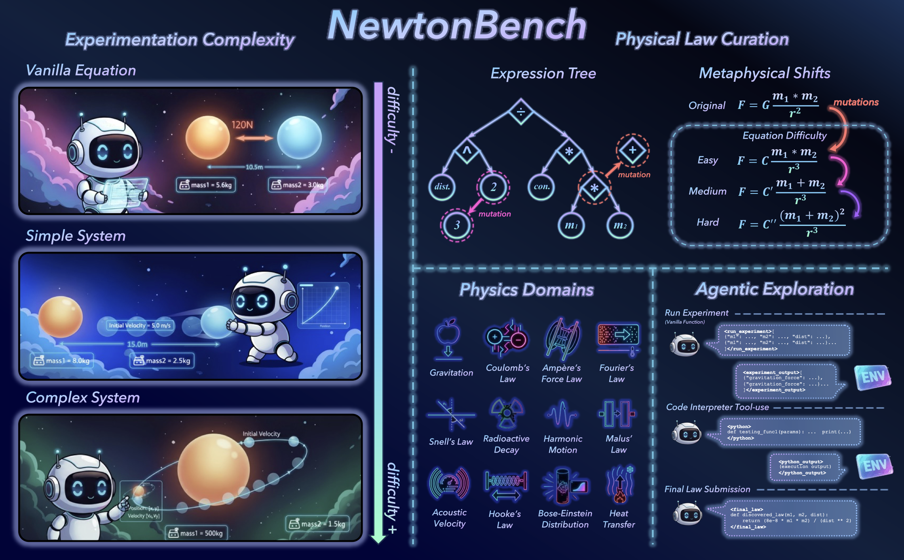

# NewtonBench: Benchmarking Generalizable Scientific Law Discovery in LLM Agents
[](https://github.com/HKUST-KnowComp/NewtonBench)
[](https://arxiv.org/abs/2510.07172)
[](https://www.python.org/)
[](https://visitorbadge.io/status?path=https%3A%2F%2Fgithub.com%2FHKUST-KnowComp%2FNewtonBench)
<div align="center">

### 🔭 **Can LLMs Rediscover Newton's Laws?** 

**324 Scientific Law Discovery Tasks • 12 Physics Domains • Interactive Model Systems**

*✨Moving beyond memorization toward true scientific discovery in complex, interactive environments✨*

</div>

---

## 🚀 **TL;DR**

**NewtonBench** is the first benchmark designed to rigorously evaluate LLMs' ability to discover scientific laws through **interactive experimentation** rather than static function fitting. Our benchmark resolves the fundamental trilemma between scientific relevance, scalability, and memorization resistance through **metaphysical shifts**—systematic alterations of canonical physical laws.

### 🎯 **Key Features**
- **324 tasks** across 12 physics domains (Gravitation, Coulomb's Law, Fourier's Law, etc.)
- **Interactive model systems** requiring active experimentation and hypothesis testing
- **Two difficulty dimensions**: law complexity (easy/medium/hard) × system complexity (vanilla/simple/complex)
- **Code-assisted evaluation** to isolate reasoning from computational constraints
- **Memorization-resistant** through metaphysical shifts of canonical laws

### 🔬 **What We Discovered**
- **Frontier models** (GPT-5, Gemini-2.5-pro) show **clear but fragile** discovery capabilities
- **Performance degrades precipitously** with increasing system complexity and noise
- **Paradoxical tool effect**: Code assistance helps weaker models but hinders stronger ones
- **Extreme noise sensitivity**: Even 0.0001 noise level causes 13-15% accuracy drop

### 🏆 **Why It Matters**
NewtonBench reveals that while LLMs are beginning to develop scientific reasoning skills, **robust, generalizable discovery in complex environments remains the core challenge** for automated science.

---
<div align="center">
  <figure>
    
    <br>
    <figcaption><em>Quick Overview of NewtonBench.</em></figcaption>
  </figure>
</div>


## 🔥 News
* **09 Oct, 2025**: The paper is released on [arXiv](https://arxiv.org/abs/2510.07172)!

## 📋 Table of Contents

- [🔥 News](#-news)
- [🚀 Get Started](#-get-started)
  - [1. Clone the Repository](#1-clone-the-repository)
  - [2. Create and Activate a Conda Environment](#2-create-and-activate-a-conda-environment)
  - [3. Install Dependencies](#3-install-dependencies)
  - [4. Set Up API Keys](#4-set-up-api-keys)
  - [5. Run the Quick Start](#5-run-the-quick-start)
- [🧭 Script Guide](#-script-guide)
- [🏗️ Project Structure](#️-project-structure)
- [🔬 Key Components](#-key-components)
- [🧪 Running Full Experiments](#-running-full-experiments)
- [📈 Analyzing Results](#analyzing-results)
- [🌟 Citation](#-citation)


## 🚀 Get Started

### 1. Clone the Repository

```
git clone https://github.com/HKUST-KnowComp/NewtonBench.git
cd NewtonBench
```

### 2. Create and Activate a Conda Environment

```
conda create --name newtonbench python=3.10.18
conda activate newtonbench
```

### 3. Install Dependencies

```
pip install -r requirements.txt
```

If you want a more reproducible environment that is closer to the maintainer's local setup, use:

```
pip install -r requirements.lock.txt
```

Dependency policy in this repo:

- `requirements.txt` uses bounded version ranges to avoid both very old and future-breaking major versions
- `requirements.lock.txt` pins a concrete snapshot for more reproducible reruns
- `networkx` and `PyYAML` are required by the current codebase and are included explicitly
- `pysr` is intentionally not part of the default install because it is only needed for the `mini_scientist` symbolic-regression path and usually requires extra system setup

### 4. Set Up API Keys

1.  In the root of the project, make a copy of the `.env.example` file and rename it `.env`.
2.  Specify the following:
    - `OPENAI_API_KEY`: Your OpenAI API key for using OpenAI models
    - `OPENROUTER_API_KEY`: Your OpenRouter API key for using models provided in OpenRouter


### 5. Run the Quick Start

You are now ready to run a quick test to ensure everything is set up correctly.

```
python run_pipeline.py --preset quick --model_name gpt41mini
```

This generates a bounded smoke test, plus logs and report files under:

```text
outputs/pipeline_runs/<run_tag>/
```

If you want to find the most recent pipeline run quickly, open:

```text
outputs/pipeline_runs/LATEST_RUN.txt
```

The easiest file for law-level results such as "law1 = 77%, law2 = 99%" is:

```text
outputs/pipeline_runs/<run_tag>/report/law_accuracy_summary.csv
```

There is also a Markdown rendering:

```text
outputs/pipeline_runs/<run_tag>/report/law_accuracy_summary.md
```

## 🧭 Script Guide

Primary scripts:

- `run_pipeline.py`: preferred top-level entrypoint; runs the experiment chain and writes logs plus report files automatically
- `run_all_evaluations.py`: runs one logical benchmark sweep with resume/check support
- `run_experiments.py`: runs one concrete experiment configuration
- `result_analysis/summarize_results.py`: builds the law/config/leaderboard reports from finished runs
- `result_analysis/compare_consistency.py`: builds side-by-side consistent vs inconsistent comparison tables from two completed run tags

Prompt-set behavior:

- `original`: clean baseline prompt with only the task description
- `modified`: prepends a relevance-filtered subset of previously discovered laws from the same conceptual family, using `consistency_groups.yml`
- when `prompt_set=modified`, the sweep now auto-enables dashboard accumulation and resets `accumulation/global_kg.json` once at sweep start, so prompt context is built from the current run instead of stale leftovers

Deprecated compatibility wrappers:

- `quick_start.py`
- `run_master.py`
- `run_benchmark.py`
- `comprehensive_benchmark.py`

These wrappers remain only to redirect old habits; new usage should go through `run_pipeline.py`.

## 🏗️ Project Structure

```
NewtonBench/
├── .env                          # environment variables (API keys)
├── configs/                      # Configuration files
│   └── models.txt                # List of LLM models to evaluate
│
├── modules/                      # Physics domain modules (12 domains)
│   ├── common/                   # Shared utilities and base classes
│   │   ├── evaluation.py         # Evaluation metrics and logic
│   │   ├── physics_base.py       # Base physics system definitions
│   │   ├── prompts_base.py       # Base prompt templates
│   │   └── types.py              # Common type definitions
│   │
│   ├── m0_gravity/               # Newton’s Law of Universal Gravitation
│   ├── m1_coulomb_force/         # Coulomb’s Law
│   ├── m2_magnetic_force/        # Ampere’s Force Law
│   ├── m3_fourier_law/           # Fourier’s Law
│   ├── m4_snell_law/             # Snell’s Law
│   ├── m5_radioactive_decay/     # Law of Radioactive Decay
│   ├── m6_underdamped_harmonic/  # Law of Damped Harmonic Motion
│   ├── m7_malus_law/             # Malus’s Law
│   ├── m8_sound_speed/           # Law of Sound Speed in Ideal Gas
│   ├── m9_hooke_law/             # Hooke’s Law
│   ├── m10_be_distribution/      # Bose-Einstein Distribution
│   └── m11_heat_transfer/        # Law of Heat Transfer
│   │
│   └── Each module contains:
│       ├── core.py               # Core experiment runner
│       ├── laws.py               # Law definitions and variations
│       ├── physics.py            # Physics simulation logic
│       ├── prompts.py            # Domain-specific prompts
│       └── m*_types.py           # Domain-specific types
│
├── utils/                        # Utility modules
│   ├── call_llm_api.py        # LLM API interface
│   ├── vanilla_agent.py          # Vanilla agent (no code execution)
│   ├── code_assisted_agent.py    # Code-assisted agent
│   ├── code_executor.py          # Code execution environment
│   ├── code_executor_base.py     # Base code executor interface
│   └── noise.py                  # Noise generation utilities
│
├── evaluation_results/           # Experimental results organized by:
│   └── {model_name}/             # - Model name
│       └── {module}/             # - Physics module
│           └── {agent_type}/     # - Agent type (vanilla/code-assisted)
│               └── {difficulty}/ # - Difficulty level
│                   └── {version}/  # - Version
│
├── result_analysis/              # Scripts for analyzing results
│   ├── summarize_results.py      # Main script to summarize results
│   ├── results_by_trial.csv      # Intermediate CSV with raw trial data
│   └── aggregated_trial_summary.csv    # Final aggregated summary
│
├── run_pipeline.py               # Preferred top-level runner + auto reporting
├── run_experiments.py            # Single configuration runner
├── run_all_evaluations.py        # Sweep runner with resume/check support
├── requirements.txt              # Python dependencies
└── README.md                   
```

### 🔬 Key Components

- **Physics Modules**: Each of the 12 physics domains is implemented as a separate module with its own physics simulation, law definitions, and prompts.
- **Agent Types**: Two agent modes are supported:
  - **Vanilla Agent**: LLM reasoning only, no code execution
  - **Code-Assisted Agent**: LLM with Python code execution capabilities
- **Difficulty Levels**: Tasks vary across two dimensions:
  - Difficulty of the target law: easy/medium/hard
  - Complexity of the model systems: vanilla equation/simple system/complex system

## 🧪 Running Full Experiments

Preferred full-run entrypoint:

```
python run_pipeline.py --preset benchmark --model_name gpt41mini
```

To use the models listed in `configs/models.txt`:

```
python run_pipeline.py --preset benchmark
```

To call the lower-level sweep runner directly:

```
python run_all_evaluations.py --model_name gpt41mini --agent_backend vanilla_agent --no_prompt
```

You can also restrict a benchmark sweep to a single law version, for example `v0`:

```
python run_pipeline.py --preset benchmark --model_name gpt41mini --law_version v0
```

By default the main benchmark excludes the `v_unchanged` control laws, so the base task count remains 324. To include them explicitly:

```
python run_pipeline.py --preset benchmark --model_name gpt41mini --include_unchanged
```

### 📈 Analyzing Results

After running `run_pipeline.py`, start here:

- `outputs/pipeline_runs/<run_tag>/RESULTS_INDEX.md`
- `outputs/pipeline_runs/<run_tag>/report/law_accuracy_summary.csv`
- `outputs/pipeline_runs/<run_tag>/report/config_summary.csv`
- `outputs/pipeline_runs/<run_tag>/report/aggregated_trial_summary.csv`
- `outputs/pipeline_runs/<run_tag>/report/summary_report.md`

What the main files mean:

1. `law_accuracy_summary.csv`: one row per law configuration; this is the easiest place to inspect law-level accuracy.
2. `config_summary.csv`: richer per-configuration metrics including accuracy, success rate, RMSLE, trial counts, and token usage.
3. `aggregated_trial_summary.csv`: higher-level leaderboard aggregated by model/backend.
4. `results_by_trial.csv`: raw trial-level rows.

You can also regenerate reports manually from `evaluation_results`:

```
python result_analysis/summarize_results.py --result_dir evaluation_results --output_dir result_analysis
```

For consistency-vs-inconsistency studies, run two matching sweeps with different `--consistency` settings and then build a side-by-side comparison:

```
python result_analysis/compare_consistency.py --result_dir evaluation_results --output_dir outputs/pipeline_runs/<compare_tag>/report --inconsistent_run_tag <run_tag_a> --consistent_run_tag <run_tag_b>
```

Or filter to one logical run:

```
python result_analysis/summarize_results.py --result_dir evaluation_results --output_dir outputs/pipeline_runs/MY_RUN/report --run_tag MY_RUN
```

## 🌟 Citation

If you use NewtonBench in your research, please cite our paper:

```
@misc{zheng2025newtonbenchbenchmarkinggeneralizablescientific,
      title={NewtonBench: Benchmarking Generalizable Scientific Law Discovery in LLM Agents}, 
      author={Tianshi Zheng and Kelvin Kiu-Wai Tam and Newt Hue-Nam K. Nguyen and Baixuan Xu and Zhaowei Wang and Jiayang Cheng and Hong Ting Tsang and Weiqi Wang and Jiaxin Bai and Tianqing Fang and Yangqiu Song and Ginny Y. Wong and Simon See},
      year={2025},
      eprint={2510.07172},
      archivePrefix={arXiv},
      primaryClass={cs.AI},
      url={https://arxiv.org/abs/2510.07172}, 
}
```


---
## 🛠️ Recent Modifications (February 2026)
We have introduced significant enhancements to the NewtonBench framework to support automated scientific discovery:

- **Mini AI Scientist Loop**: Implemented a complete end-to-end discovery loop (`mini_scientist`) that automates data collection, symbolic regression using PySR, and automated paper generation.
- **Enhanced Metrics**: Integrated advanced evaluation metrics including **Symbolic Accuracy** (via SymPy), **RMSE**, and **RMSLE** to better quantify law discovery performance.
- **Knowledge Graph (KG) Optimizations**: Refined the KG construction logic to handle complex operators and improve the success rate of discovering physical laws.
- **Improved Dashboard**: Enhanced the dashboard for better visualization of experimental results and discovery metrics.
- **Performance Improvements**: Optimized PySR parameters and KG generation for more reliable identification of canonical physical laws.

---
## Contacts

Tianshi Zheng (tzhengad@connect.ust.hk)

Kelvin Kiu-Wai Tam (kwtamai@connect.ust.hk)

Newt Hue-Nam K. Nguyen (khnnguyen@connect.ust.hk)
